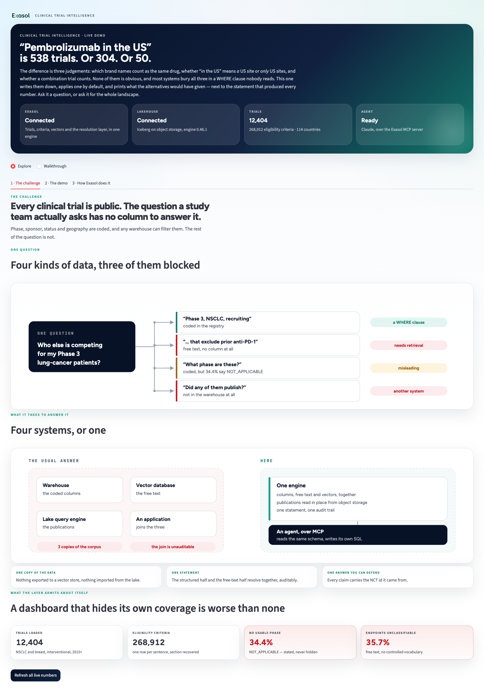
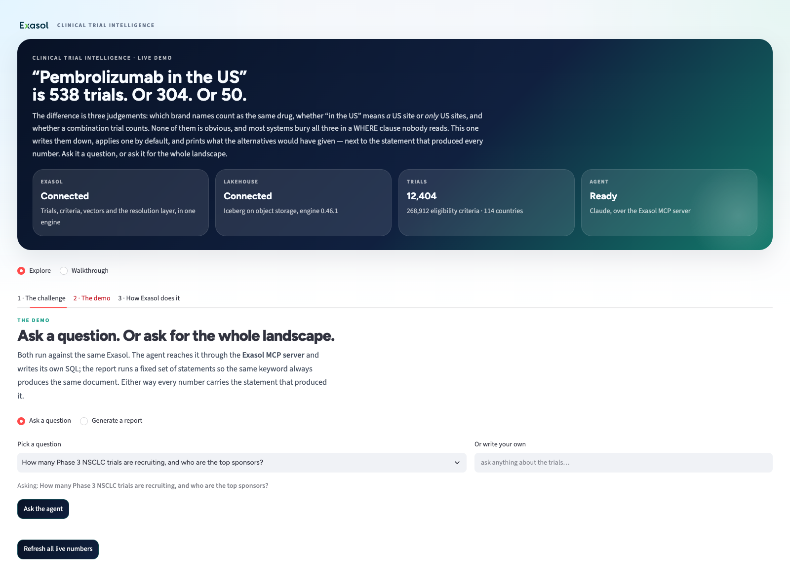
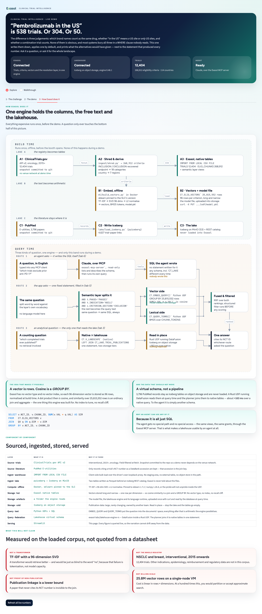
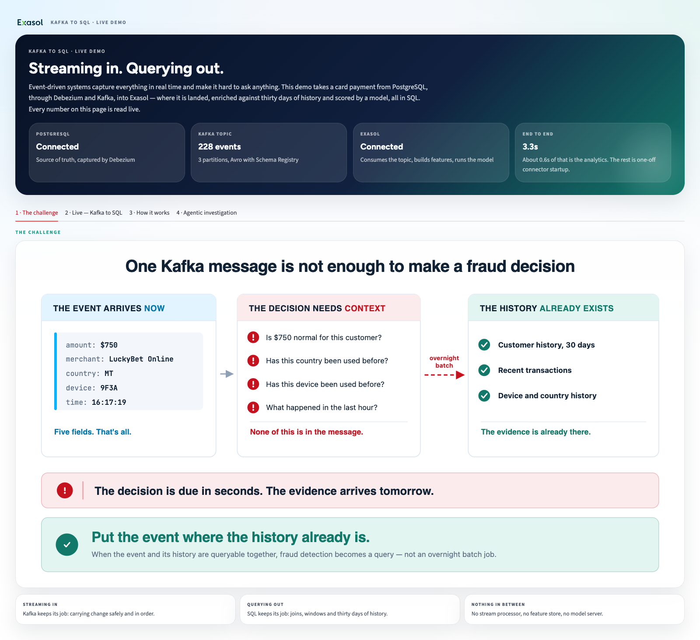
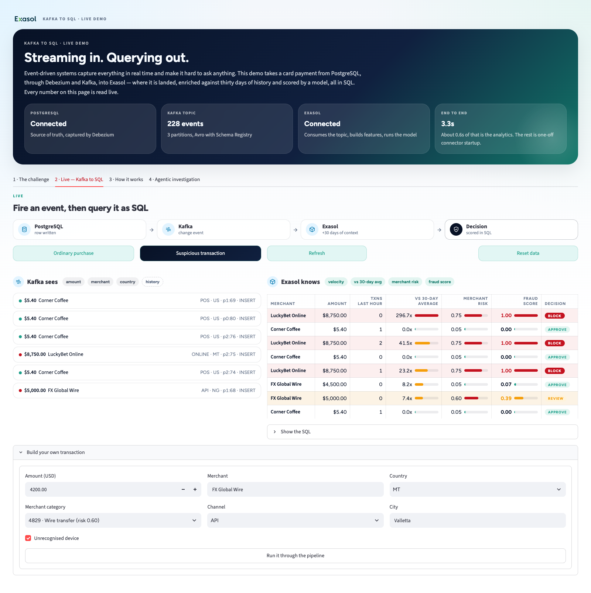
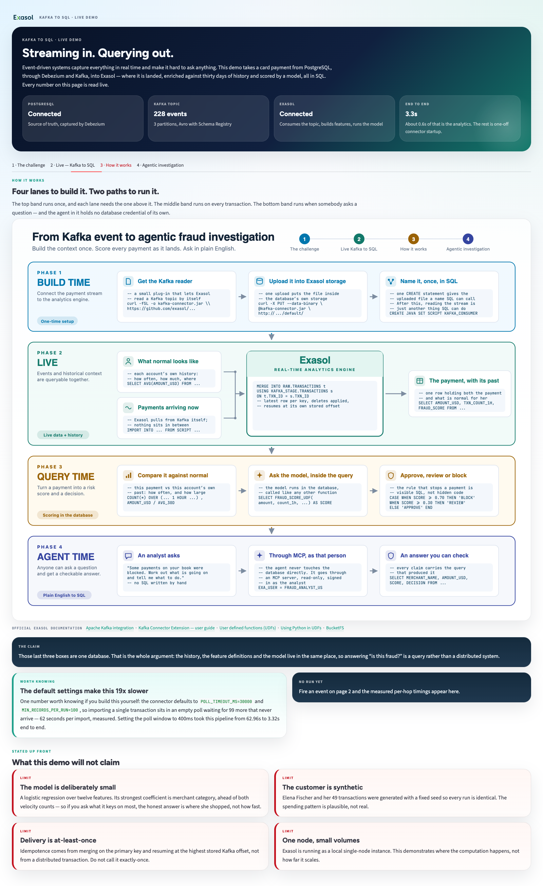
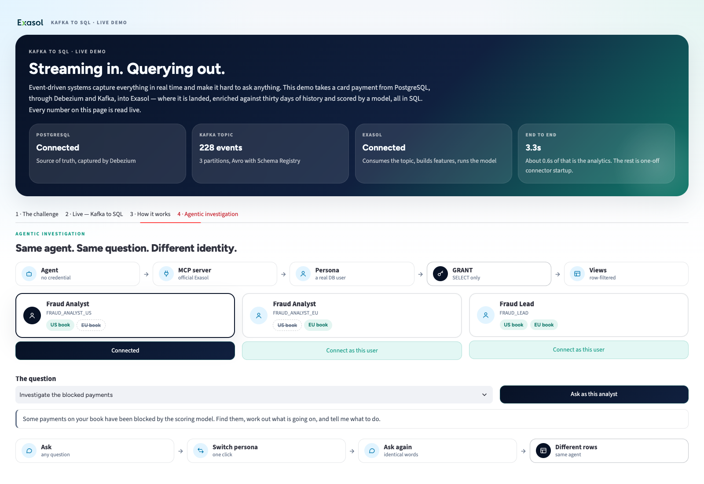

# Open Source India 2026: Exasol booth assets

The demos and the booth video from Exasol's booth at **Open Source India, 7–8 October 2026**.

## Video

**[Exasol-Complete-Story-v12.mp4](https://github.com/yuvi-ex/opensourceeventassets/releases/download/v1.0-event/Exasol-Complete-Story-v12.mp4)** is the booth video (161 MB).
It's attached to the [`v1.0-event` release](https://github.com/yuvi-ex/opensourceeventassets/releases/tag/v1.0-event) because it's too large for git.

## Slides

Coming soon.

## The builds

| Build | What it's for | Platform |
|---|---|---|
| [`clinical-trials-demo/`](clinical-trials-demo/) | Clinical trial intelligence. Ask a question in English, an agent writes and runs SQL on Exasol over MCP, and it answers citing trial IDs. The demo shows why a semantic layer is where "which trials count" decisions belong. | Exasol Personal (macOS / Linux) with the PYTHON3 SLC, Docker, and Python 3 + Streamlit (`app/run.sh`). An `ANTHROPIC_API_KEY` is optional, for the agent. |
| [`kafka-to-sql-demo/`](kafka-to-sql-demo/) | "Streaming in. Querying out.", the Kafka-to-SQL stage demo. It tells the story of a card payment in seven acts: PostgreSQL → Debezium CDC → Kafka → Exasol, where it's enriched against 30 days of the customer's history and scored by an ML model inside the database. Then an AI agent answers questions as a specific analyst, seeing only what that analyst may see. Every number is read live. | Python 3 + Streamlit (port 8502) on a running Postgres + Kafka + Exasol stack under Docker Compose. It's an add-on folder: it expects to sit inside the banking fraud pipeline project and reads that project's `.env` and `demo_dashboard.py`. |

Each folder has its own README with full setup steps. `kafka-to-sql-demo/DEMO_BRIEF.md` is the speaker's reference.

### Notes

- **clinical-trials-demo:** the large generated files (vectors, the model, the lakehouse engine) are not included. The numbered scripts rebuild them. Copy `.env.example` to `.env` for the API key.
- **kafka-to-sql-demo:** its README's commands say `story_demo/`, the folder's name at the booth. Use whatever you name the folder; the code finds its own files by relative path.

## Screenshots

Captured from the running booth apps, one per tab. The files are in each folder's `screenshots/` directory.

### Clinical trial intelligence

**1 · The challenge**

**2 · The demo**

**3 · How Exasol does it**

### Kafka to SQL

**1 · The challenge**

**2 · Live: Kafka to SQL**

**3 · How it works**

**4 · Agentic investigation**

## Credits and licensing

This repository is under the [MIT License](LICENSE).
