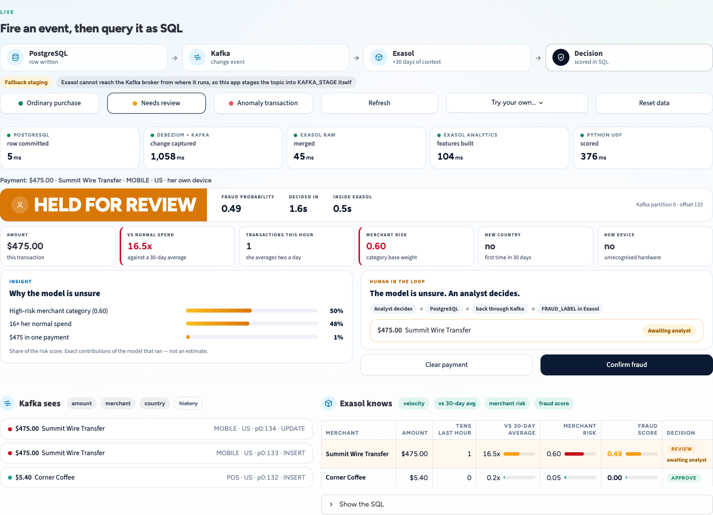

# Kafka to SQL — real-time fraud detection with Exasol

A live demo. A card payment is written to PostgreSQL, captured by Debezium, carried
by Kafka, landed in Exasol next to thirty days of history, and scored by a model —
all in SQL. When the model is unsure, a person decides, and that decision flows back
through the same pipeline as a training label. Then an AI agent investigates through
Exasol's MCP server, seeing only what the analyst it runs as is allowed to see.

Every number on screen is read live from the running PostgreSQL, Kafka and Exasol.
The customer throughout is **Elena Fischer**, a synthetic persona with 30 days of
ordinary card history.

> **Quick start.** Needs the
> [banking fraud pipeline](https://github.com/SanjayG-Data/real-time-banking-fraud-pipeline)
> running (Docker Compose + Exasol) and Python 3.11+. After the one-time
> [first-run steps](#first-run-once), start it with `kafka-to-sql-demo/start_demo.sh`
> and open **http://localhost:8502**. Full steps under [Run it](#run-it).

---

## The UI

Four tabs, one story: the problem, the live pipeline, how it is built, and asking
questions of the result.

### 1 · The challenge


One payment followed through a typical stream-plus-warehouse setup. The stream has
to decide in seconds with only one message, so it approves; the nightly warehouse
knows it was fraud — nine hours later. Below it, what the gap costs: this payment at
the industry's true cost of fraud, and card fraud losses worldwide.

### 2 · Live — Kafka to SQL


Three presets, one per outcome — each a real payment through the real pipeline:

| Button | Payment | Outcome |
|---|---|---|
| **Ordinary purchase** | $5.40 at a café, her own phone | APPROVED |
| **Needs review** | a wire to a new payee, at home, her own phone | HELD FOR REVIEW |
| **Anomaly transaction** | $8,750 at an online casino in Malta, an unknown device | BLOCKED |

**Try your own…** opens a small form for any payment the audience asks about; it runs
through exactly the same path. Each hop is timed on screen (see
[Timings](#timings) for what the numbers measure).

For a blocked payment the page adds two cards:

- **Insight — why the model stopped it.** The drivers of the score in plain English,
  each with its share of the risk. These are the exact per-feature contributions of
  the logistic regression that ran (coefficient × scaled value), not an estimate.
- **Next best action.** Up to three recommended steps chosen from the drivers that
  actually fired: verify on her own phone (new device), freeze the card abroad (new
  country), flag the merchant (risky category), call the customer (unusual size),
  lower the hourly limit (velocity).

Underneath, **Kafka sees** one raw event; **Exasol knows** its velocity, how it compares
with 30 days of normal spend, the merchant risk, the score and the analyst's outcome.
The SQL behind the table is one click away.

### Human in the loop



A payment in the review band is not decided by the model. It is held, and an alert is
opened in PostgreSQL's `fraud_alerts`, where analysts work. **Clear payment** or
**Confirm fraud** is an ordinary UPDATE there, so it travels the same road as the
payment did — Debezium → Kafka → Exasol — where the analytics refresh turns it into
`FRAUD_LABEL`, the column the model is retrained on. The card shows the round trip
(about a second) once the decision lands.

One state, named at each layer:

| Layer | Blocked | In review | Approved |
|---|---|---|---|
| Model decision (`DECISION` column) | `BLOCK` | `REVIEW` | `APPROVE` |
| On screen | BLOCKED | HELD FOR REVIEW | APPROVED |
| PostgreSQL `transactions.status` | `SETTLED` ¹ | `FLAGGED` → `DECLINED` / `SETTLED` after the analyst | `SETTLED` |
| PostgreSQL `fraud_alerts.status` | — | `OPEN` → `CONFIRMED_FRAUD` / `FALSE_POSITIVE` | — |
| Exasol `FRAUD_LABEL` | — | `NULL` → `TRUE` / `FALSE` | — |

¹ Deliberately left settled: the agent in tab 4 is meant to discover that a blocked
payment went through anyway.

The **Needs review** preset picks the payment size the model is least sure about *right
now*: the score depends strongly on how many payments were made in the last hour, so
a fixed amount would only land in review if buttons were pressed in one order. It
reproduces the features the refresh will compute, asks the real scoring UDF, and fires
the closest candidate; the score shown is the one the pipeline computes. If nothing
could land in review (too many payments this hour), it says so and asks for a reset.

### 3 · How it works


The architecture in four phases — **build** the Kafka reader into Exasol once,
**stream** every payment in next to its history, **score** it in SQL with a Python
UDF, **ask** about it in plain English. After a run, the measured per-hop timings
appear underneath.

### 4 · Agentic investigation


The agent has no database credential of its own. It reaches Exasol through the
official MCP server, signed in as a **persona** — a real database user holding
SELECT on two row-filtered views and nothing else. Ask the same question as the US
analyst, the EU analyst and the fraud lead: the answer changes because the rows do,
not because the agent behaved differently. Every answer cites the statement that
produced it, and the audit trail is read back as that analyst.

The agent runs on **Claude Opus 5** (`claude-opus-5`) at medium reasoning effort
(`DEMO_AGENT_EFFORT`), on your own Anthropic API key. A question takes 35–45 s and
3–5 model turns; one measured run used about 13,000 input and 2,000 output tokens —
roughly **$0.10–0.25 per question** at Opus 5 list prices ($5 / $25 per million
input / output tokens).

---

## How it's built

Five steps for one payment. Steps 3–5 run inside one database.

| # | Step | Where | What happens |
|---|---|---|---|
| 1 | Payment written | PostgreSQL | a row is inserted into `transactions` |
| 2 | Change captured | Debezium → Kafka | Debezium reads the Postgres change log and publishes the row as Avro on `banking_avro.public.transactions` |
| 3 | Landed | Exasol | the Kafka connector (a Java UDF in BucketFS) runs `IMPORT … FROM SCRIPT` into `KAFKA_STAGE`, then a `MERGE` into `RAW.TRANSACTIONS` — or the fallback stages it, see below |
| 4 | Features built | Exasol SQL | `07_refresh_analytics_features.sql` compares the payment with that account's 30 days of history using window functions and joins |
| 5 | Scored | Exasol Python UDF | `ANALYTICS.FRAUD_SCORE_UDF` loads the model from BucketFS and returns a fraud probability; a `CASE` turns it into a decision |

**Decision thresholds:** `APPROVE` if score < 0.30 · `REVIEW` if 0.30 ≤ score < 0.70 ·
`BLOCK` if score ≥ 0.70.

For a REVIEW, the loop continues: `fraud_alerts` row in PostgreSQL → Debezium →
`banking_avro.public.fraud_alerts` → `RAW.FRAUD_ALERTS` → `FRAUD_LABEL`.

The pipeline itself — schemas, the Kafka connector setup, the scoring UDF
(`02_features_and_udfs.sql`) and the training script (`train_pipeline.py`) — lives in
the parent
[real-time-banking-fraud-pipeline](https://github.com/SanjayG-Data/real-time-banking-fraud-pipeline)
repo. This folder is the demo UI on top of it.

### Timings

The Live tab shows two numbers, and they measure different things:

| On screen | Measures | Typical |
|---|---|---|
| **Decided in** | the whole path: PostgreSQL write → Kafka → Exasol → score | ~1.3 s with fallback staging; ~3.3 s with Exasol's own connector |
| **Debezium + Kafka** (a hop card) | the import hop: waiting for Debezium to publish, then staging | ~0.7 s with fallback staging; ~2.7 s with the connector |
| **Inside Exasol** | the merge, features and scoring steps only | ~0.5 s either way |

The two paths differ by about 2 s, all of it in the import hop and none of it in the
analytics. With the connector, most of that hop is its JVM start-up inside the UDF
sandbox (~2.6 s), which overlaps the ~0.7 s Debezium takes to publish — hence ~2 s
extra, not 2.6 s. The start-up is paid once per `IMPORT` statement — per batch, not
per payment: one import carries up to `MAX_RECORDS_PER_RUN` (5,000) messages, so a
steady stream spreads those ~2.6 s across thousands of events. The demo shows the
worst case, because every click runs its own import for a single payment. The
analytics inside Exasol is ~0.5 s on both paths. The 3.32 s in
[lesson 1](#lessons-from-building-it) is the connector path, measured when the tuning
was done.

## The model

**A logistic regression** — scikit-learn `LogisticRegression(class_weight="balanced")`
behind a `StandardScaler`, pickled to BucketFS as `fraud_model.pkl` (`LOGREG_DEMO_v1`).

**Twelve inputs, all computed in SQL** from the payment and its history:

| Group | Features |
|---|---|
| Size | amount; amount vs her 30-day average |
| Velocity | payments in the last hour and 24 hours; their totals |
| Novelty | new country in 30 days; new device in 30 days; cross-border |
| Timing | night-time; weekend |
| Merchant | base risk weight of the merchant category (casino 0.75, café 0.05, …) |

**Why logistic regression**

1. **It explains itself.** One weight per feature; the score is the sum of
   weight × value through a sigmoid — which is what makes the Insight card exact. A
   blocked payment can be justified to a regulator or a customer.
2. **It is fast and small.** Scoring is a handful of multiplications, so it runs
   inside a SQL UDF in milliseconds, with no separate model server.
3. **It keeps the focus on the architecture.** The point is that event, history
   and model live in one database; a simple model keeps attention there.
4. **It is swappable.** The UDF loads any pickled scikit-learn-style model, so a
   gradient-boosted model (XGBoost, LightGBM) drops in without touching the
   pipeline or the SQL.

**How it was trained — and what not to claim.** The shipped model is trained on
5,000 synthetic rows at a 4% fraud rate, where the fraudulent rows were generated
larger, faster and more often cross-border. The training report shows AUC 1.0;
that only says the model separates data generated to be separable, so it is not
an accuracy figure. In production it would be retrained on real labelled fraud —
the labels the human-in-the-loop step writes — probably with a stronger model;
`train_pipeline.py --source exasol` trains from labels in `ANALYTICS.FRAUD_FEATURES`.

---

## Run it

### Prerequisites

- **The pipeline running**, from
  [real-time-banking-fraud-pipeline](https://github.com/SanjayG-Data/real-time-banking-fraud-pipeline):
  its Docker Compose stack (PostgreSQL, Kafka, Schema Registry, Debezium), an Exasol
  database, and its SQL scripts and model deployed (`docker compose up -d --build`,
  then `bash deploy.sh` — see that repo's README).
- **Python 3.11+** and the parent repo's virtual environment (`.venv`).
- **An Anthropic API key** — only for tab 4 (the agent). Tabs 1–3 work without it.

### Install

```bash
# inside your checkout of real-time-banking-fraud-pipeline
git clone https://github.com/yuvi-ex/OSI-2026.git /tmp/OSI-2026
cp -r /tmp/OSI-2026/kafka-to-sql-demo .

./.venv/bin/pip install -r requirements.txt -r kafka-to-sql-demo/requirements.txt
```

The app reads the parent repo's `.env`. Besides the keys in its `.env.example`, set:

```bash
POSTGRES_HOST=localhost
POSTGRES_PORT=5432            # the host port your compose file publishes
EXASOL_DSN=localhost:8563     # see the note below
ANTHROPIC_API_KEY=...         # tab 4 only
```

`EXASOL_DSN=localhost:8563` is right for Exasol Personal, which forwards the database
port to `127.0.0.1:8563` on the host, and for Exasol in Docker with port 8563
published. Point it elsewhere only if your Exasol runs on another machine.

### First run (once)

```bash
./.venv/bin/python kafka-to-sql-demo/seed_story_persona.py   # Elena Fischer + 30 days of history
./.venv/bin/python kafka-to-sql-demo/setup_personas.py      # three read-only analyst users for tab 4
./.venv/bin/python kafka-to-sql-demo/sync_history.py        # import every topic into Exasol, build features
```

Want to look at the data first? [`sample_data/`](sample_data/) has the demo customer,
her 30-day history and the three scored payments as CSV.

> **Credentials.** `setup_personas.py` creates three database users with fixed demo
> passwords (in `mcp_client.py`). They hold SELECT on two row-filtered views only, but
> change them before running this anywhere shared.

### Every time

```bash
kafka-to-sql-demo/start_demo.sh
```

Open **http://localhost:8502**.

### How Exasol reaches Kafka

There are two Kafka addresses, and they are configured in different places:

| Who connects | Address | Configured in |
|---|---|---|
| **This app** (Kafka column, fallback staging) | `localhost:29092`, Schema Registry `http://localhost:8081` | `DEMO_KAFKA_BOOTSTRAP`, `DEMO_SCHEMA_REGISTRY` (set by `start_demo.sh`) |
| **Exasol's connector** (the `IMPORT … FROM SCRIPT`) | whatever Exasol can reach — upstream default `kafka:9092`, `http://schema-registry:8081` | `BOOTSTRAP_SERVERS` and `SCHEMA_REGISTRY_URL` in the parent repo's `05_exasol_kafka_connector_import_avro.sql` and in `IMPORT_TRANSACTIONS_SQL` in its `demo_dashboard.py` |

- **Exasol in Docker on the compose network:** keep the defaults; the parent repo's
  `prepare_exasol_docker.sh` makes `kafka` and `schema-registry` resolve inside the
  Exasol container.
- **Exasol Personal on macOS** runs in a VM that reaches the host over a bridge
  (`ifconfig bridge100` shows its address, typically `192.168.64.1`). Give Kafka a
  listener advertised on that address, then use it in both SQL files, for example
  `BOOTSTRAP_SERVERS = '192.168.64.1:39092'`,
  `SCHEMA_REGISTRY_URL = 'http://192.168.64.1:8081'`:

  Bind the ports to the loopback and bridge addresses only — never all interfaces,
  or anyone on the same network can reach the broker once the host firewall allows
  Docker:

  ```yaml
  # docker-compose.override.yml in the parent repo
  services:
    kafka:
      ports: !override
        - "127.0.0.1:29092:29092"      # host clients (this app)
        - "192.168.64.1:39092:39092"   # the Exasol VM, via the bridge
      environment:
        KAFKA_LISTENER_SECURITY_PROTOCOL_MAP: PLAINTEXT:PLAINTEXT,PLAINTEXT_HOST:PLAINTEXT,PLAINTEXT_VM:PLAINTEXT
        KAFKA_LISTENERS: PLAINTEXT://0.0.0.0:9092,PLAINTEXT_HOST://0.0.0.0:29092,PLAINTEXT_VM://0.0.0.0:39092
        KAFKA_ADVERTISED_LISTENERS: PLAINTEXT://kafka:9092,PLAINTEXT_HOST://localhost:29092,PLAINTEXT_VM://192.168.64.1:39092
        KAFKA_INTER_BROKER_LISTENER_NAME: PLAINTEXT
    schema-registry:
      ports: !override
        - "127.0.0.1:8081:8081"        # host clients (this app)
        - "192.168.64.1:8081:8081"     # the Exasol VM, via the bridge
  ```

  **Start Exasol before `docker compose up`.** The bridge interface (and its
  `192.168.64.1` address) exists only while the Exasol VM is running; if Compose
  starts first, Docker cannot bind that address and the containers fail to start.

### Settings

| Variable | Default | What it does |
|---|---|---|
| `DEMO_KAFKA_BOOTSTRAP` | `localhost:29092` (set by `start_demo.sh`) | Where the app itself reads the topic |
| `DEMO_SCHEMA_REGISTRY` | `http://localhost:8081` (set by `start_demo.sh`) | Avro schemas for the same |
| `DEMO_STAGE_MODE` | `auto` | `connector`, `host` or `auto` — see below |
| `DEMO_AGENT_EFFORT` | `medium` | Reasoning effort for the agent; `high` is deeper and slower |

### "Fallback staging"

The intended path is Exasol's own
[Kafka connector](https://github.com/exasol/kafka-connector-extension): Exasol reads
the topic itself with an `IMPORT … FROM SCRIPT`. That needs Exasol to reach the
broker at the address above. Where it cannot, `auto` mode notices at start-up (a
two-second Kafka handshake to that address) and reads the topic on the host instead,
writing the same rows into `KAFKA_STAGE`, partition and offset included. The Live tab
shows a **Fallback staging** chip whenever that is happening. Because the connector
resumes from the offsets stored in that table, either path can take over from the
other with nothing skipped or duplicated.

---

## Troubleshooting

**`E-KCE-24: Timeout trying to connect to Kafka brokers`**, or `catalog request failed`
from other UDFs — Exasol cannot reach a service on the host. On a Mac with a managed
(MDM) firewall, the usual cause is that Docker Desktop is not allowed to accept
incoming connections, so traffic from the Exasol VM is dropped.

- A port check is **not** enough: the TCP handshake can succeed while the data is
  dropped, so `nc -vz 192.168.64.1 39092` may report "open". Test at the application
  level instead: `curl -s -o /dev/null -w "%{http_code}\n" http://192.168.64.1:8081/subjects`
  should print `200`; a timeout means the path is blocked. (Checked on a blocked Mac:
  from the Mac itself this times out, while `localhost:8081` answers — the firewall
  filters the Mac's own traffic to the bridge address too, so the test is valid. The
  definitive test is a Kafka import inside Exasol completing without E-KCE-24.)
- Check the firewall: `/usr/libexec/ApplicationFirewall/socketfilterfw --listapps`.
  If `/Applications/Docker.app` shows "Block incoming connections", it needs to be
  allowed — an admin can run
  `sudo /usr/libexec/ApplicationFirewall/socketfilterfw --unblockapp /Applications/Docker.app`;
  on a managed Mac, ask IT to add Docker Desktop (`com.docker.docker`) to the
  firewall profile's allowed applications.
- Until then, `auto` mode keeps the demo working through fallback staging.

**"No borderline payment right now"** after pressing Needs review — too many payments
in the last hour for any wire to land in the review band. Press **Reset data**.

**The Fallback staging chip is showing** — expected when Exasol cannot reach the broker
(above). Everything still works; the import step is done by the app instead of the
connector.

**Scores creep up between rehearsals** — velocity counts every payment in the last
hour. Press **Reset data** before presenting.

**"Newest first" order looks wrong** — the Exasol VM's clock can drift after the host
sleeps. The app orders by the transaction's own timestamp, so results stay correct;
restart the Exasol deployment to resync the clock.

**Tab 4: "No Anthropic API key" or "no credit"** — set `ANTHROPIC_API_KEY` in the
parent repo's `.env` and restart the app.

---

## Presenting it

1. `kafka-to-sql-demo/start_demo.sh`
2. **Reset data** on the Live tab — removes every payment the demo created and waits
   until those deletes have reached Exasol; the 30-day history survives. Reset again
   after a long rehearsal, so velocity starts from zero.
3. Run one agent question before the audience arrives (≈40 s), which also confirms
   the API key.

Suggested flow: tab 1 sets up the $8,750 payment → tab 2 fires **Ordinary purchase**,
**Needs review** (decide it live) and **Anomaly transaction** → tab 3 shows where each
step ran → tab 4 asks the agent about it as three different people.

---

## Tested on

The free **Exasol Personal** edition, on a laptop. It shows where the work happens,
not how far it scales.

| | |
|---|---|
| Edition | Exasol Personal, local deployment (`exasol install local`) |
| Exasol Personal CLI | 2.3.0 |
| Database | Exasol 2026.2.0 (`2026.2.0-nano.3`), 1 node |
| VM | 2 vCPUs · 24 GB RAM · 100 GB data disk |
| UDF languages | Python 3.12 and Java 17 (script-language containers 11.2.0) |
| Kafka connector | `exasol-kafka-connector-extension-2.0.0.jar` in BucketFS |
| Connector tuning | `POLL_TIMEOUT_MS=400`, `MIN_RECORDS_PER_RUN=1`, `MAX_RECORDS_PER_RUN=5000`, `CONSUME_ALL_OFFSETS=true` |
| Model | `fraud_model.pkl` in BucketFS, scikit-learn 1.7.2 |
| Host | Apple M5 Pro (18 cores, 48 GB RAM), macOS 26.6, arm64 |

The demo's data is well under 1 GB.

---

## Lessons from building it

Three things surfaced while building the demo. Each is solved in this folder's code;
they are worth knowing if you build something similar.

**1. Connector defaults cost a minute per event — tuning two settings fixes it.** The
Kafka connector defaults to `POLL_TIMEOUT_MS=30000` and `MIN_RECORDS_PER_RUN=100`, so
importing one transaction waits in an empty poll for 99 more. With
`POLL_TIMEOUT_MS='400'` and `MIN_RECORDS_PER_RUN='1'`, the connector path went from
**62.96 s to 3.32 s** end to end at the time (`TUNED_IMPORT` in `pipeline.py`).

**2. Velocity features need history spread over real time.** Seed data created within
the same half hour makes every payment look like a burst, and leaves the 30-day
average nothing to average. `seed_story_persona.py` spreads 49 ordinary payments
across 30 real days: a $29.55 baseline and a genuinely empty velocity window.

**3. Deletes must reach the feature tables too.** The analytics refresh only MERGEs,
so a transaction deleted upstream would stay inside the velocity windows and every
rehearsal would score higher than the last. `reset_story()` removes those rows from
the downstream tables (`PRUNE_ORPHANS`) and waits until the deletes have arrived.

---

## What this demo does not claim

- **The model is deliberately small** — a logistic regression over twelve features.
- **The customer is synthetic** — Elena Fischer is seeded, identical on every run.
- **Delivery is at-least-once** — idempotent by key and offset, not exactly-once.
- **One node, small volumes** — it shows where the computation happens, not how far
  it scales.
- **Next best actions are recommendations** — chosen by rules from the model's
  drivers; nothing is executed against the card.

**Figures on tab 1.** Card fraud losses were $33.41 billion worldwide in 2024
([Nilson Report](https://nilsonreport.com/articles/card-fraud-losses-worldwide-2024/)).
Every $1 of fraud costs North American financial institutions more than $5 in total
([LexisNexis Risk Solutions, 2025](https://risk.lexisnexis.com/about-us/press-room/press-release/20250910-fraud-multiplier)),
so "$43,750+" is $8,750 at that multiplier — a lower bound. The nine-hour batch window
is illustrative.

---

## Files

```
app.py                 the Streamlit app — four tabs
pipeline.py            connections, tuned import, fallback staging, run_event,
                       human review (open / resolve), reset, full sync
agent.py               the investigation loop (Claude + Exasol MCP)
mcp_client.py          personas and the MCP server settings (read-only)
architecture.py        the drawn diagrams (tabs 1 and 3)
theme.py               styling
chapters.py, story.py  page copy and the scripted payments
seed_story_persona.py  the demo customer + 30 days of history
setup_personas.py      the three database users and their row-filtered views
sync_history.py        import every topic, merge into RAW, rebuild features
sample_data/           the demo customer, her history and three scored payments (CSV)
sql/                   persona and audit DDL
requirements.txt       Python packages on top of the parent repo's
start_demo.sh          one-command start
screenshots/           the images above
```

Run logs are written to `runs/` (ignored by git).

## License

MIT — see the repository's [LICENSE](../LICENSE).
